# Track report

Generated by `node tools/track_report.mjs` from `AHDEV.trackReport(id)` (open the game with `?dev` to call it live).
The checks follow the ZER0-G course checker (`tools/track_design.py`, MIT, witnesstodark/zer0-g): length, tightest radius,
straights, a pace curve and self-clearance, plus a plan image per event in `docs/track-plans/`.

How to read it:

- **Straight** (S1, S2, ...): |curvature| under 0.0025 /m (radius over 400 m) for at least 120 m. Start `s` is metres from the start line.
- **Corner** (T1, T2, ... as labelled on the plan): |curvature| over 0.006 /m (radius under ~170 m) for at least 6 m. `R` is the apex radius, `vC` the most a
  reference car holds through it (stepRacer's lateral model v²·k/2 ≤ grip, grip 30, top 85 m/s), `brake` the brake-board
  distance before the corner entry from the speed you can carry off the run-in (braking 40 m/s²). A brake of 0 means a lift
  or flat-out corner. These are not lap-time predictions; they rank corners against each other.
- **Clearance**: two parts of the centreline more than 60 m apart along the lap that come closer than two road widths plus
  4 m in plan. Pairs more than 5 m apart in height are listed as crossings (bridges, tunnels), not warnings.
- Plan colours: grey straight, white sweeper, amber corner, pink hairpin (R < 50 m), yellow squares are brake boards over 30 m,
  red lines clearance warnings, green dot the start.

## Summary

| Event | Length | Road | Tightest R (at) | Straights | Longest | Straight % | Corners | Clearance warnings | Climb |
|---|---|---|---|---|---|---|---|---|---|
| Harbor Line (`tunnel`) | 2123 m | 16 m | 67 m (1986 m) | 1 | 188 m | 9% | 8 | 0 | 14 m |
| Roosevelt Blvd (`blvd`) | 3357 m | 12 m | 25 m (787 m) | 2 | 1579 m | 94% | 2 | 0 | 0 m |
| The Bridge Run (`bridge`) | 4829 m | 14 m | 18 m (2291 m) | 5 | 2015 m | 93% | 5 | 0 | 30 m |
| The Long Night (`grand`) | 7879 m | 14 m | 24 m (7586 m) | 7 | 2037 m | 93% | 7 | 0 | 58 m |
| The Gauntlet (`ko`) | 1695 m | 14 m | 24 m (1232 m) | 4 | 432 m | 84% | 4 | 0 | 0 m |
| Dockside Dash (`dockside`) | 1337 m | 14 m | 16 m (520 m) | 4 | 363 m | 60% | 8 | 0 | 0 m |
| Skyline Circuit (`skyline`) | 3933 m | 14 m | 8 m (0 m) | 7 | 731 m | 89% | 7 | 5 | 12 m |
| Midnight Express (`midnight`) | 10579 m | 14 m | 24 m (10186 m) | 7 | 2692 m | 95% | 7 | 0 | 58 m |
| Philly Classic (`philly`) | 8724 m | 14 m | 24 m (8431 m) | 7 | 2474 m | 94% | 7 | 0 | 30 m |
| Mt Airy Run (`mtairy`) | 2695 m | 12 m | 41 m (1541 m) | 3 | 482 m | 41% | 7 | 0 | 20.9 m |
| Game Night (`gamenight`) | 2839 m | 14 m | 16 m (0 m) | 7 | 527 m | 82% | 8 | 0 | 0 m |
| Manayunk Wall (`manayunk`) | 2735 m | 13 m | 85 m (1369 m) | 3 | 814 m | 65% | 3 | 0 | 31.9 m |
| Under the El (`el`) | 2795 m | 14 m | 10 m (2579 m) | 5 | 833 m | 86% | 6 | 0 | 0 m |
| First Light (`firstlight`) | 3964 m | 14 m | 50 m (1866 m) | 10 | 354 m | 55% | 5 | 0 | 4.5 m |
| Neon Core (`neoncore`) | 2927 m | 14 m | 16 m (5 m) | 4 | 747 m | 60% | 12 | 0 | 13.9 m |
| Calder Basin (`calder`) | 5549 m | 14 m | 20 m (2851 m) | 5 | 960 m | 51% | 16 | 0 | 31 m |

## Harbor Line (`tunnel`)

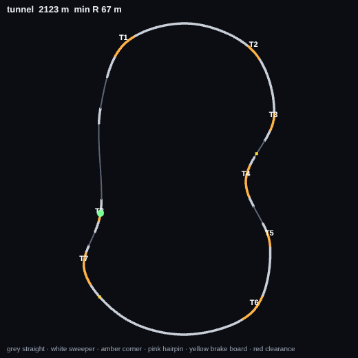

2123 m lap, 2 laps, road 16 m wide. Tightest radius 67 m at 1986 m. 9% of the lap is straight.

Pace curve (corner radii in order, m): 112 · 134 · 89 · 76 · 100 · 102 · 67 · 153

| Piece | Starts at | Length | R (apex) | Dir | vC | Run-in | Brake board |
|---|---|---|---|---|---|---|---|
| S1 straight | 33 m | 188 m | | | | | |
| T1 | 394 m | 70 m | 112 m | R | 183 mph | 397 m | 6 m |
| T2 | 763 m | 45 m | 134 m | R | 190 mph | 299 m | flat / lift |
| T3 | 947 m | 48 m | 89 m | R | 163 mph | 139 m | 24 m |
| T4 | 1093 m | 81 m | 76 m | L | 151 mph | 98 m | 34 m |
| T5 | 1271 m | 38 m | 100 m | R | 174 mph | 97 m | 15 m |
| T6 | 1436 m | 76 m | 102 m | R | 175 mph | 126 m | 14 m |
| T7 | 1937 m | 84 m | 67 m | R | 142 mph | 426 m | 40 m |
| T8 | 2106 m | 15 m | 153 m | L | 190 mph | 85 m | flat / lift |

Clearance (need 20 m): no warnings.

## Roosevelt Blvd (`blvd`)

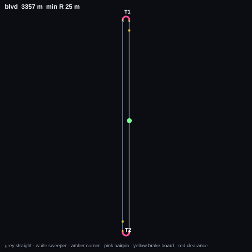

3357 m lap, 2 laps, road 12 m wide. Tightest radius 25 m at 787 m. 94% of the lap is straight.

Pace curve (corner radii in order, m): 25 · 25

| Piece | Starts at | Length | R (apex) | Dir | vC | Run-in | Brake board |
|---|---|---|---|---|---|---|---|
| T1 | 752 m | 96 m | 25 m | L | 87 mph | 1583 m | 72 m |
| S1 straight | 850 m | 1578 m | | | | | |
| T2 | 2430 m | 96 m | 25 m | L | 87 mph | 1582 m | 72 m |
| S2 straight | 2528 m | 1579 m | | | | | |

Clearance (need 16 m): no warnings.

## The Bridge Run (`bridge`)

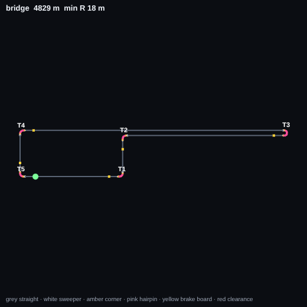

4829 m lap, 3 laps, road 14 m wide. Tightest radius 18 m at 2291 m. 93% of the lap is straight.

Pace curve (corner radii in order, m): 24 · 24 · 18 · 24 · 24

| Piece | Starts at | Length | R (apex) | Dir | vC | Run-in | Brake board |
|---|---|---|---|---|---|---|---|
| T1 | 645 m | 59 m | 24 m | L | 86 mph | 729 m | 72 m |
| S1 straight | 708 m | 242 m | | | | | |
| T2 | 954 m | 59 m | 24 m | R | 86 mph | 250 m | 72 m |
| S2 straight | 1017 m | 1215 m | | | | | |
| T3 | 2235 m | 80 m | 18 m | L | 74 mph | 1222 m | 76 m |
| S3 straight | 2318 m | 2015 m | | | | | |
| T4 | 4337 m | 59 m | 24 m | L | 86 mph | 2022 m | 72 m |
| S4 straight | 4400 m | 282 m | | | | | |
| T5 | 4686 m | 59 m | 24 m | L | 86 mph | 290 m | 72 m |
| S5 straight | 4749 m | 721 m | | | | | |

Clearance (need 18 m): no warnings.

## The Long Night (`grand`)

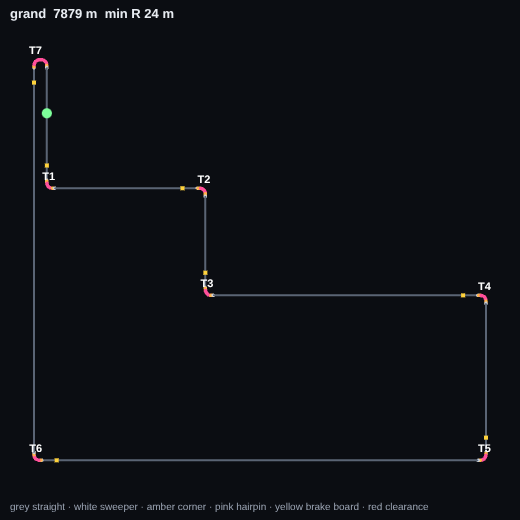

7879 m lap, 2 laps, road 14 m wide. Tightest radius 24 m at 7586 m. 93% of the lap is straight.

Pace curve (corner radii in order, m): 24 · 24 · 24 · 24 · 24 · 24 · 24

| Piece | Starts at | Length | R (apex) | Dir | vC | Run-in | Brake board |
|---|---|---|---|---|---|---|---|
| T1 | 315 m | 59 m | 24 m | L | 86 mph | 529 m | 72 m |
| S1 straight | 378 m | 662 m | | | | | |
| T2 | 1044 m | 59 m | 24 m | R | 86 mph | 670 m | 72 m |
| S2 straight | 1107 m | 422 m | | | | | |
| T3 | 1533 m | 59 m | 24 m | L | 86 mph | 430 m | 72 m |
| S3 straight | 1596 m | 1236 m | | | | | |
| T4 | 2836 m | 59 m | 24 m | R | 86 mph | 1244 m | 72 m |
| S4 straight | 2899 m | 692 m | | | | | |
| T5 | 3595 m | 59 m | 24 m | R | 86 mph | 700 m | 72 m |
| S5 straight | 3658 m | 2037 m | | | | | |
| T6 | 5699 m | 59 m | 24 m | R | 86 mph | 2045 m | 72 m |
| S6 straight | 5762 m | 1792 m | | | | | |
| T7 | 7557 m | 108 m | 24 m | R | 86 mph | 1800 m | 72 m |
| S7 straight | 7669 m | 521 m | | | | | |

Clearance (need 18 m): no warnings.

## The Gauntlet (`ko`)

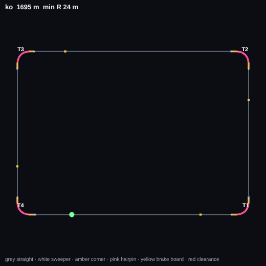

1695 m lap, 99 laps, road 14 m wide. Tightest radius 24 m at 1232 m. 84% of the lap is straight.

Pace curve (corner radii in order, m): 24 · 24 · 24 · 24

| Piece | Starts at | Length | R (apex) | Dir | vC | Run-in | Brake board |
|---|---|---|---|---|---|---|---|
| T1 | 355 m | 59 m | 24 m | L | 86 mph | 439 m | 72 m |
| S1 straight | 418 m | 282 m | | | | | |
| T2 | 704 m | 59 m | 24 m | L | 86 mph | 290 m | 72 m |
| S2 straight | 767 m | 432 m | | | | | |
| T3 | 1203 m | 59 m | 24 m | L | 86 mph | 440 m | 72 m |
| S3 straight | 1266 m | 282 m | | | | | |
| T4 | 1552 m | 59 m | 24 m | L | 86 mph | 290 m | 72 m |
| S4 straight | 1615 m | 431 m | | | | | |

Clearance (need 18 m): no warnings.

## Dockside Dash (`dockside`)

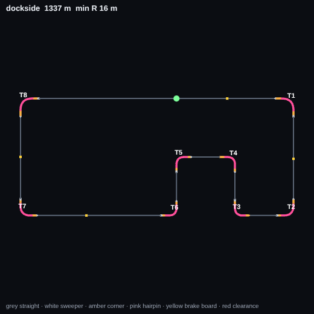

1337 m lap, 3 laps, road 14 m wide. Tightest radius 16 m at 520 m. 60% of the lap is straight.

Pace curve (corner radii in order, m): 17 · 16 · 16 · 16 · 16 · 16 · 16 · 17

| Piece | Starts at | Length | R (apex) | Dir | vC | Run-in | Brake board |
|---|---|---|---|---|---|---|---|
| T1 | 154 m | 46 m | 17 m | R | 72 mph | 367 m | 77 m |
| S1 straight | 202 m | 126 m | | | | | |
| T2 | 330 m | 42 m | 16 m | R | 70 mph | 130 m | 65 m |
| T3 | 416 m | 39 m | 16 m | R | 69 mph | 44 m | 22 m |
| T4 | 502 m | 39 m | 16 m | L | 69 mph | 47 m | 23 m |
| T5 | 587 m | 39 m | 16 m | L | 69 mph | 46 m | 23 m |
| T6 | 673 m | 39 m | 16 m | R | 69 mph | 47 m | 23 m |
| S2 straight | 713 m | 191 m | | | | | |
| T7 | 906 m | 42 m | 16 m | R | 70 mph | 194 m | 78 m |
| S3 straight | 950 m | 126 m | | | | | |
| T8 | 1078 m | 46 m | 17 m | R | 72 mph | 130 m | 65 m |
| S4 straight | 1126 m | 363 m | | | | | |

Clearance (need 18 m): no warnings.

## Skyline Circuit (`skyline`)

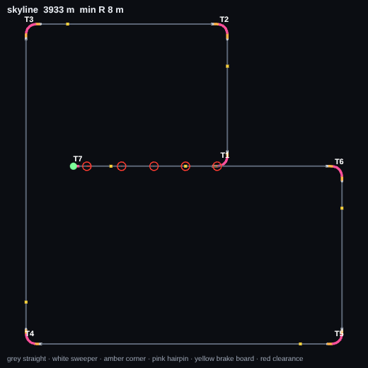

3933 m lap, 2 laps, road 14 m wide. Tightest radius 8 m at 0 m. 89% of the lap is straight.

Pace curve (corner radii in order, m): 24 · 24 · 24 · 24 · 25 · 24 · 8

| Piece | Starts at | Length | R (apex) | Dir | vC | Run-in | Brake board |
|---|---|---|---|---|---|---|---|
| S1 straight | 14 m | 337 m | | | | | |
| T1 | 355 m | 59 m | 24 m | L | 86 mph | 341 m | 72 m |
| S2 straight | 418 m | 282 m | | | | | |
| T2 | 704 m | 59 m | 24 m | L | 86 mph | 290 m | 72 m |
| S3 straight | 767 m | 432 m | | | | | |
| T3 | 1203 m | 59 m | 24 m | L | 86 mph | 440 m | 72 m |
| S4 straight | 1266 m | 731 m | | | | | |
| T4 | 2001 m | 59 m | 24 m | L | 86 mph | 739 m | 72 m |
| S5 straight | 2064 m | 723 m | | | | | |
| T5 | 2791 m | 58 m | 25 m | L | 86 mph | 731 m | 72 m |
| S6 straight | 2853 m | 373 m | | | | | |
| T6 | 3230 m | 59 m | 24 m | L | 86 mph | 381 m | 72 m |
| S7 straight | 3293 m | 628 m | | | | | |
| T7 | 3921 m | 26 m | 8 m | L | 49 mph | 632 m | 84 m |

Clearance (need 18 m): 34-120 m vs 3890 m: 1 m apart; 122-202 m vs 3810 m: 1 m apart; 204-282 m vs 3730 m: 1 m apart; 284-362 m vs 3650 m: 1 m apart; 364-396 m vs 3570 m: 1 m apart.

## Midnight Express (`midnight`)

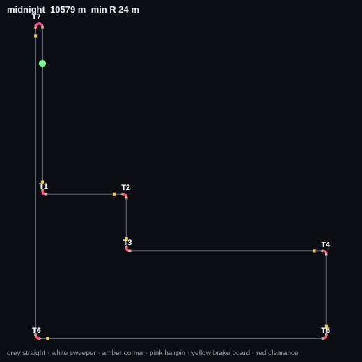

10579 m lap, 1 laps, road 14 m wide. Tightest radius 24 m at 10186 m. 95% of the lap is straight.

Pace curve (corner radii in order, m): 24 · 24 · 24 · 24 · 24 · 24 · 24

| Piece | Starts at | Length | R (apex) | Dir | vC | Run-in | Brake board |
|---|---|---|---|---|---|---|---|
| T1 | 1115 m | 59 m | 24 m | L | 86 mph | 1429 m | 72 m |
| S1 straight | 1178 m | 662 m | | | | | |
| T2 | 1844 m | 59 m | 24 m | R | 86 mph | 670 m | 72 m |
| S2 straight | 1907 m | 422 m | | | | | |
| T3 | 2333 m | 59 m | 24 m | L | 86 mph | 430 m | 72 m |
| S3 straight | 2396 m | 1686 m | | | | | |
| T4 | 4086 m | 59 m | 24 m | R | 86 mph | 1694 m | 72 m |
| S4 straight | 4149 m | 692 m | | | | | |
| T5 | 4845 m | 59 m | 24 m | R | 86 mph | 700 m | 72 m |
| S5 straight | 4908 m | 2487 m | | | | | |
| T6 | 7399 m | 59 m | 24 m | R | 86 mph | 2495 m | 72 m |
| S6 straight | 7462 m | 2692 m | | | | | |
| T7 | 10157 m | 108 m | 24 m | R | 86 mph | 2700 m | 72 m |
| S7 straight | 10269 m | 1421 m | | | | | |

Clearance (need 18 m): no warnings.

## Philly Classic (`philly`)

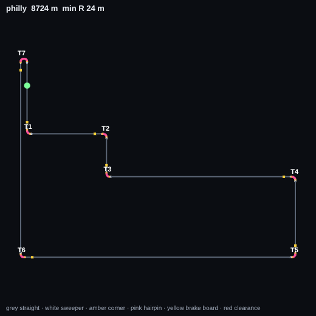

8724 m lap, 3 laps, road 14 m wide. Tightest radius 24 m at 8431 m. 94% of the lap is straight.

Pace curve (corner radii in order, m): 28 · 28 · 28 · 28 · 28 · 28 · 24

| Piece | Starts at | Length | R (apex) | Dir | vC | Run-in | Brake board |
|---|---|---|---|---|---|---|---|
| T1 | 412 m | 64 m | 28 m | L | 91 mph | 626 m | 70 m |
| S1 straight | 481 m | 653 m | | | | | |
| T2 | 1138 m | 65 m | 28 m | R | 91 mph | 662 m | 70 m |
| S2 straight | 1208 m | 313 m | | | | | |
| T3 | 1525 m | 65 m | 28 m | L | 91 mph | 322 m | 70 m |
| S3 straight | 1594 m | 1678 m | | | | | |
| T4 | 3277 m | 64 m | 28 m | R | 91 mph | 1687 m | 70 m |
| S4 straight | 3346 m | 663 m | | | | | |
| T5 | 4014 m | 64 m | 28 m | R | 91 mph | 673 m | 70 m |
| S5 straight | 4083 m | 2474 m | | | | | |
| T6 | 6561 m | 65 m | 28 m | R | 91 mph | 2483 m | 70 m |
| S6 straight | 6631 m | 1767 m | | | | | |
| T7 | 8402 m | 108 m | 24 m | R | 86 mph | 1776 m | 72 m |
| S7 straight | 8514 m | 617 m | | | | | |

Clearance (need 18 m): no warnings.

## Mt Airy Run (`mtairy`)

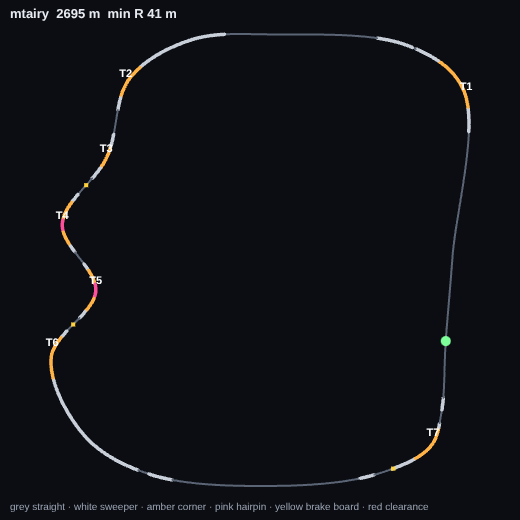

2695 m lap, 3 laps, road 12 m wide. Tightest radius 41 m at 1541 m. 41% of the lap is straight.

Pace curve (corner radii in order, m): 99 · 88 · 115 · 44 · 41 · 55 · 62

| Piece | Starts at | Length | R (apex) | Dir | vC | Run-in | Brake board |
|---|---|---|---|---|---|---|---|
| T1 | 423 m | 100 m | 99 m | L | 172 mph | 580 m | 16 m |
| S1 straight | 641 m | 275 m | | | | | |
| T2 | 1082 m | 66 m | 88 m | L | 163 mph | 559 m | 24 m |
| T3 | 1240 m | 40 m | 115 m | R | 186 mph | 91 m | 4 m |
| T4 | 1362 m | 84 m | 44 m | L | 116 mph | 82 m | 41 m |
| T5 | 1500 m | 83 m | 41 m | R | 110 mph | 54 m | 27 m |
| T6 | 1647 m | 82 m | 55 m | L | 128 mph | 64 m | 32 m |
| S2 straight | 2022 m | 339 m | | | | | |
| T7 | 2467 m | 71 m | 62 m | L | 137 mph | 738 m | 44 m |
| S3 straight | 2593 m | 482 m | | | | | |

Clearance (need 16 m): no warnings.

## Game Night (`gamenight`)

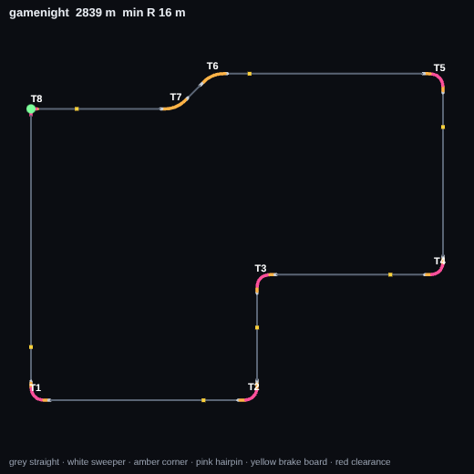

2839 m lap, 2 laps, road 14 m wide. Tightest radius 16 m at 0 m. 82% of the lap is straight.

Pace curve (corner radii in order, m): 24 · 24 · 23 · 23 · 25 · 55 · 55 · 16

| Piece | Starts at | Length | R (apex) | Dir | vC | Run-in | Brake board |
|---|---|---|---|---|---|---|---|
| S1 straight | 14 m | 527 m | | | | | |
| T1 | 545 m | 59 m | 24 m | L | 86 mph | 531 m | 72 m |
| S2 straight | 608 m | 372 m | | | | | |
| T2 | 984 m | 59 m | 24 m | L | 86 mph | 380 m | 72 m |
| S3 straight | 1047 m | 174 m | | | | | |
| T3 | 1224 m | 57 m | 23 m | R | 83 mph | 181 m | 73 m |
| S4 straight | 1285 m | 295 m | | | | | |
| T4 | 1584 m | 56 m | 23 m | L | 84 mph | 303 m | 73 m |
| S5 straight | 1644 m | 324 m | | | | | |
| T5 | 1972 m | 59 m | 25 m | L | 86 mph | 332 m | 72 m |
| S6 straight | 2034 m | 389 m | | | | | |
| T6 | 2428 m | 52 m | 55 m | L | 128 mph | 397 m | 49 m |
| T7 | 2525 m | 52 m | 55 m | R | 128 mph | 45 m | 23 m |
| S7 straight | 2582 m | 244 m | | | | | |
| T8 | 2826 m | 27 m | 16 m | L | 69 mph | 249 m | 78 m |

Clearance (need 18 m): no warnings.

## Manayunk Wall (`manayunk`)

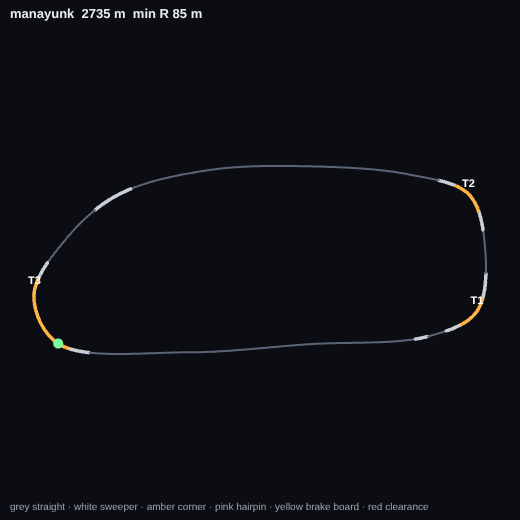

2735 m lap, 3 laps, road 13 m wide. Tightest radius 85 m at 1369 m. 65% of the lap is straight.

Pace curve (corner radii in order, m): 87 · 85 · 91

| Piece | Starts at | Length | R (apex) | Dir | vC | Run-in | Brake board |
|---|---|---|---|---|---|---|---|
| S1 straight | 81 m | 814 m | | | | | |
| T1 | 1013 m | 91 m | 87 m | L | 161 mph | 979 m | 25 m |
| T2 | 1321 m | 90 m | 85 m | L | 160 mph | 217 m | 27 m |
| S2 straight | 1450 m | 778 m | | | | | |
| S3 straight | 2326 m | 181 m | | | | | |
| T3 | 2555 m | 214 m | 91 m | L | 165 mph | 1143 m | 22 m |

Clearance (need 17 m): no warnings.

## Under the El (`el`)

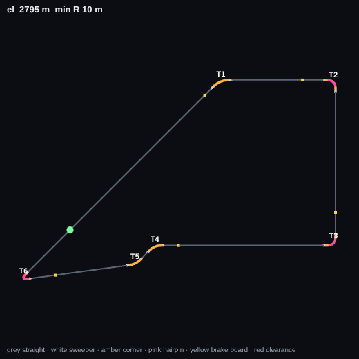

2795 m lap, 3 laps, road 14 m wide. Tightest radius 10 m at 2579 m. 86% of the lap is straight.

Pace curve (corner radii in order, m): 68 · 23 · 23 · 51 · 58 · 10

| Piece | Starts at | Length | R (apex) | Dir | vC | Run-in | Brake board |
|---|---|---|---|---|---|---|---|
| T1 | 649 m | 58 m | 68 m | R | 143 mph | 844 m | 39 m |
| S1 straight | 714 m | 295 m | | | | | |
| T2 | 1013 m | 56 m | 23 m | R | 84 mph | 306 m | 73 m |
| S2 straight | 1073 m | 456 m | | | | | |
| T3 | 1532 m | 57 m | 23 m | R | 84 mph | 463 m | 73 m |
| S3 straight | 1593 m | 512 m | | | | | |
| T4 | 2110 m | 49 m | 51 m | L | 123 mph | 521 m | 52 m |
| T5 | 2195 m | 45 m | 58 m | R | 131 mph | 36 m | 18 m |
| S4 straight | 2245 m | 311 m | | | | | |
| T6 | 2559 m | 41 m | 10 m | R | 56 mph | 319 m | 83 m |
| S5 straight | 2604 m | 833 m | | | | | |

Clearance (need 18 m): no warnings.

## First Light (`firstlight`)

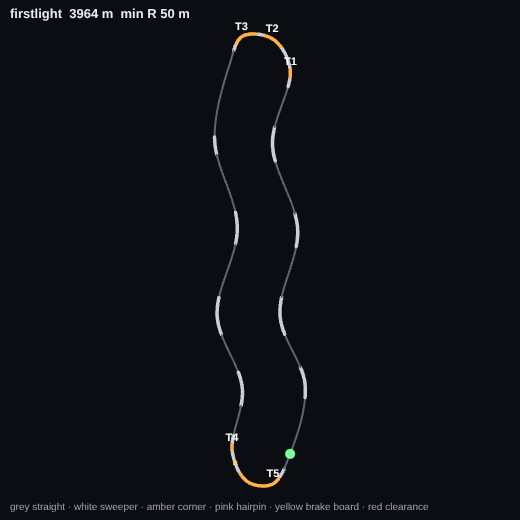

3964 m lap, 3 laps, road 14 m wide. Tightest radius 50 m at 1866 m. 55% of the lap is straight.

Pace curve (corner radii in order, m): 108 · 98 · 50 · 119 · 59

| Piece | Starts at | Length | R (apex) | Dir | vC | Run-in | Brake board |
|---|---|---|---|---|---|---|---|
| S1 straight | 354 m | 148 m | | | | | |
| S2 straight | 650 m | 212 m | | | | | |
| S3 straight | 992 m | 225 m | | | | | |
| S4 straight | 1352 m | 171 m | | | | | |
| T1 | 1563 m | 39 m | 108 m | L | 180 mph | 1658 m | 10 m |
| T2 | 1691 m | 87 m | 98 m | L | 172 mph | 89 m | 17 m |
| T3 | 1804 m | 105 m | 50 m | L | 123 mph | 26 m | 13 m |
| S5 straight | 1929 m | 354 m | | | | | |
| S6 straight | 2351 m | 246 m | | | | | |
| S7 straight | 2720 m | 226 m | | | | | |
| S8 straight | 3094 m | 165 m | | | | | |
| S9 straight | 3394 m | 123 m | | | | | |
| T4 | 3554 m | 30 m | 119 m | L | 189 mph | 1644 m | 1 m |
| T5 | 3673 m | 196 m | 59 m | L | 133 mph | 89 m | 45 m |
| S10 straight | 3901 m | 296 m | | | | | |

Clearance (need 18 m): no warnings.

## Neon Core (`neoncore`)

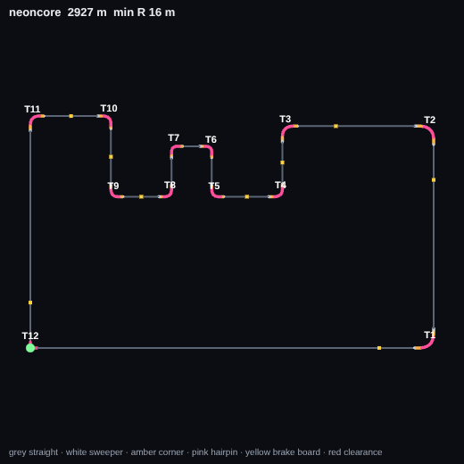

2927 m lap, 2 laps, road 14 m wide. Tightest radius 16 m at 5 m. 60% of the lap is straight.

Pace curve (corner radii in order, m): 24 · 23 · 20 · 16 · 16 · 16 · 16 · 16 · 16 · 16 · 17 · 16

| Piece | Starts at | Length | R (apex) | Dir | vC | Run-in | Brake board |
|---|---|---|---|---|---|---|---|
| S1 straight | 14 m | 747 m | | | | | |
| T1 | 765 m | 59 m | 24 m | L | 86 mph | 751 m | 72 m |
| S2 straight | 828 m | 364 m | | | | | |
| T2 | 1196 m | 56 m | 23 m | L | 84 mph | 372 m | 73 m |
| S3 straight | 1256 m | 231 m | | | | | |
| T3 | 1489 m | 50 m | 20 m | L | 77 mph | 237 m | 76 m |
| T4 | 1626 m | 43 m | 16 m | R | 70 mph | 87 m | 44 m |
| T5 | 1761 m | 41 m | 16 m | R | 69 mph | 92 m | 46 m |
| T6 | 1857 m | 39 m | 16 m | L | 69 mph | 55 m | 28 m |
| T7 | 1933 m | 38 m | 16 m | L | 69 mph | 37 m | 19 m |
| T8 | 2027 m | 41 m | 16 m | R | 69 mph | 56 m | 28 m |
| T9 | 2142 m | 40 m | 16 m | R | 69 mph | 74 m | 37 m |
| T10 | 2296 m | 43 m | 16 m | L | 70 mph | 113 m | 57 m |
| T11 | 2448 m | 46 m | 17 m | L | 72 mph | 109 m | 55 m |
| S4 straight | 2496 m | 418 m | | | | | |
| T12 | 2914 m | 27 m | 16 m | L | 69 mph | 420 m | 78 m |

Clearance (need 18 m): no warnings.

## Calder Basin (`calder`)

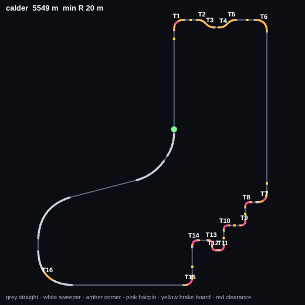

5549 m lap, 3 laps, road 14 m wide. Tightest radius 20 m at 2851 m. 51% of the lap is straight.

Pace curve (corner radii in order, m): 44 · 59 · 59 · 59 · 59 · 51 · 44 · 23 · 23 · 23 · 21 · 20 · 20 · 28 · 37 · 156

| Piece | Starts at | Length | R (apex) | Dir | vC | Run-in | Brake board |
|---|---|---|---|---|---|---|---|
| T1 | 603 m | 93 m | 44 m | R | 115 mph | 1973 m | 57 m |
| T2 | 780 m | 52 m | 59 m | R | 134 mph | 84 m | 42 m |
| T3 | 842 m | 53 m | 59 m | L | 134 mph | 10 m | 5 m |
| T4 | 923 m | 52 m | 59 m | L | 133 mph | 28 m | 14 m |
| T5 | 985 m | 53 m | 59 m | R | 133 mph | 10 m | 5 m |
| T6 | 1159 m | 105 m | 51 m | R | 124 mph | 121 m | 52 m |
| S1 straight | 1273 m | 960 m | | | | | |
| T7 | 2242 m | 92 m | 44 m | R | 115 mph | 977 m | 57 m |
| T8 | 2373 m | 57 m | 23 m | L | 83 mph | 39 m | 20 m |
| T9 | 2503 m | 56 m | 23 m | R | 84 mph | 73 m | 37 m |
| T10 | 2622 m | 57 m | 23 m | L | 84 mph | 63 m | 32 m |
| T11 | 2764 m | 53 m | 21 m | R | 79 mph | 85 m | 43 m |
| T12 | 2827 m | 48 m | 20 m | R | 77 mph | 10 m | 5 m |
| T13 | 2880 m | 49 m | 20 m | L | 77 mph | 5 m | 3 m |
| T14 | 2981 m | 64 m | 28 m | L | 91 mph | 52 m | 26 m |
| S2 straight | 3050 m | 169 m | | | | | |
| T15 | 3226 m | 82 m | 37 m | R | 106 mph | 181 m | 62 m |
| S3 straight | 3314 m | 667 m | | | | | |
| T16 | 4113 m | 66 m | 156 m | R | 190 mph | 805 m | flat / lift |
| S4 straight | 4720 m | 416 m | | | | | |
| S5 straight | 5524 m | 620 m | | | | | |

Clearance (need 18 m): no warnings.
